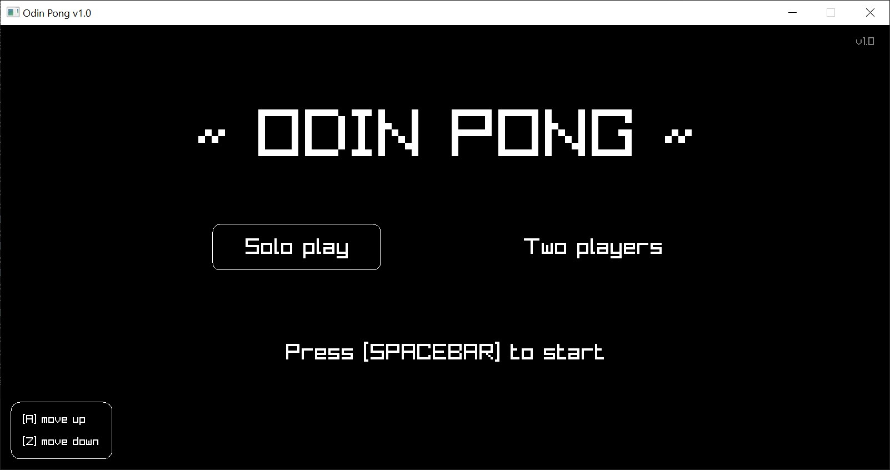
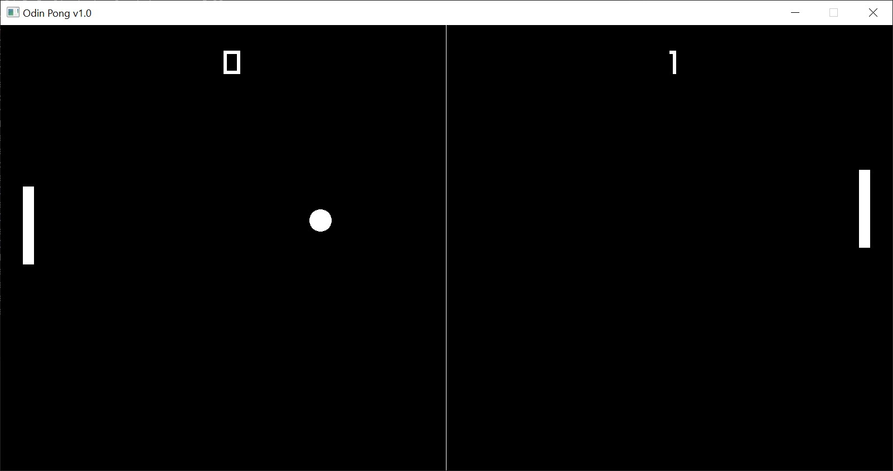

# Odin Pong

I wanted to learn some new language and the result is this pong game
coded with [Odin](https://odin-lang.org) + [raylib](https://www.raylib.com/).
Odin is like C, but simpler, fast and painless to compile, I like it!.
It's been a while since I coded in something like pure C so it's a
bit of a mess but it works, baby! 😎.

## Features

- Play solo against a dumb AI or some puny human.
- Simple controls lol just two keys per player.
- Nostalgic HD sound effects.
- Epic background music.

## Screenshots

## Credits

- Developed by yours truly, [Jesus Veracierta](mailto:tribality.tech@gmail.com)
- SFX made with [Chiptone](https://sfbgames.itch.io/chiptone)
- Music by Spencer Y.K. from Pixabay
